# 🛡️ Task 4 – Setup and Use a Firewall on Windows and Linux

> **Cyber Security Internship – Elevate Labs**

This project demonstrates the configuration, verification, and management of host-based firewalls on **Windows 10** and **Ubuntu Linux**. The objective was to understand how firewall rules control network traffic by creating, verifying, testing, and removing rules using **Windows Defender Firewall** and **UFW (Uncomplicated Firewall)**.

---

# 📑 Table of Contents

- Objective
- Environment
- Windows Firewall Configuration
- Linux UFW Configuration
- Commands Used
- Skills Demonstrated
- Summary
- Outcome
- Interview Questions
- Key Concepts
- References
- Conclusion

---

# 🎯 Objective

Configure and test firewall rules to allow or block network traffic using:

- Windows Defender Firewall with Advanced Security
- UFW (Uncomplicated Firewall)

The task included:

- Viewing existing firewall rules
- Creating firewall rules
- Blocking TCP Port 23 (Telnet)
- Allowing TCP Port 22 (SSH)
- Verifying firewall rules
- Removing temporary rules to restore the original configuration

---

# 💻 Environment

| Component | Details |
|-----------|---------|
| Host | VMware Workstation |
| Virtual Machines | Windows 10, Ubuntu |
| Windows Firewall | Windows Defender Firewall with Advanced Security |
| Linux Firewall | UFW (Uncomplicated Firewall) |
| Verification | GUI + Command Line |

---

# 🪟 Part 1 – Windows Defender Firewall (Windows 10)

## Step 1 – Open Windows Defender Firewall

Opened **Windows Defender Firewall with Advanced Security** and verified that all three profiles were enabled.

- Domain Profile
- Private Profile
- Public Profile

Observed default behavior:

- Incoming connections → Blocked
- Outgoing connections → Allowed

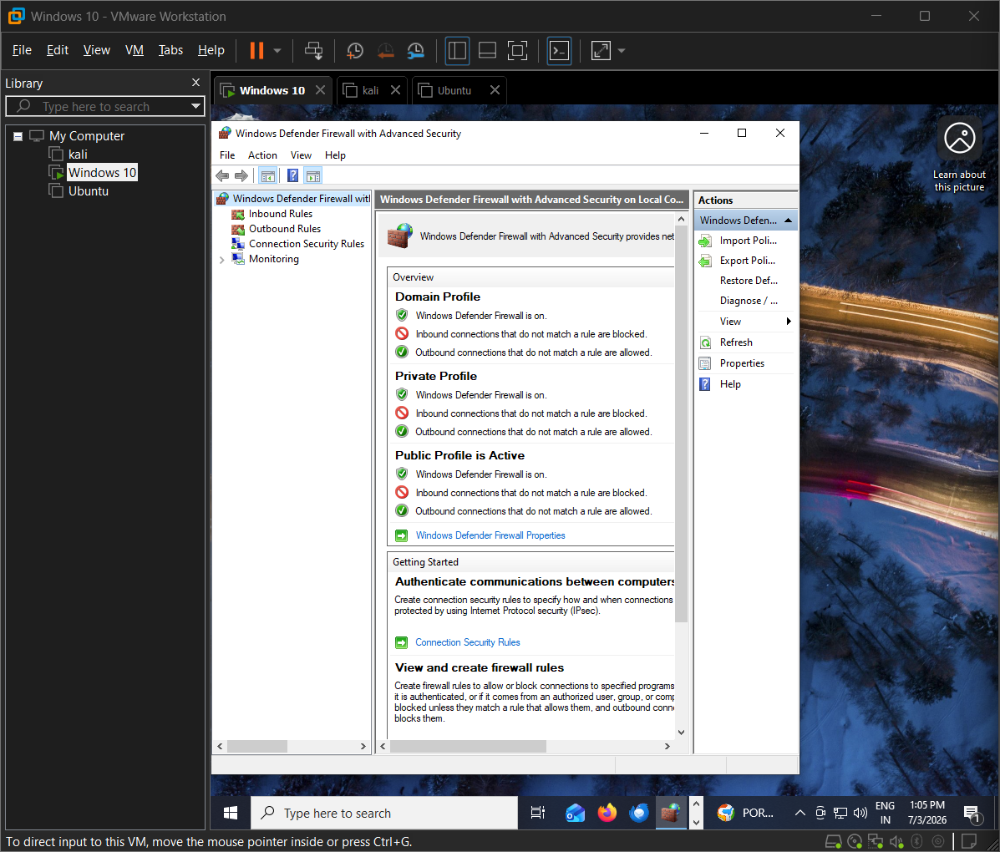

---

## Step 2 – Review Existing Inbound Rules

Reviewed the default inbound firewall rules before creating any custom rules.

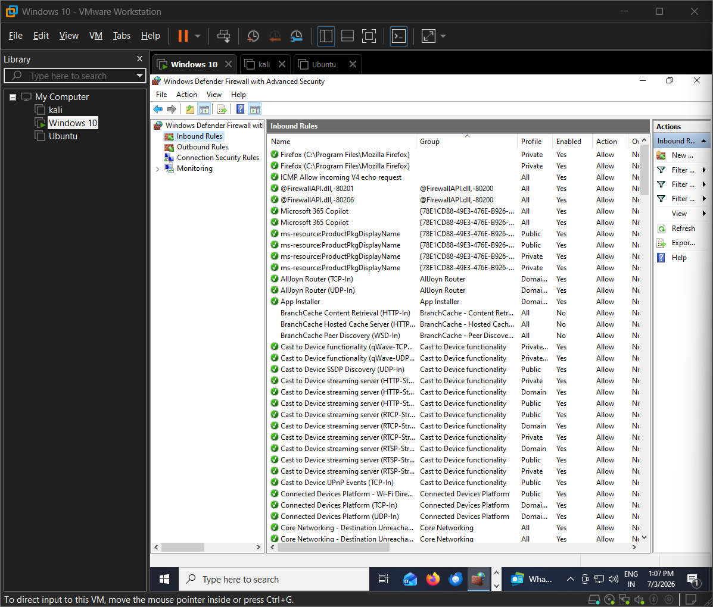

---

## Step 3 – Create an Inbound Rule

Created a custom inbound firewall rule with the following configuration:

- Rule Type: Port
- Protocol: TCP
- Local Port: 23
- Action: Block the connection
- Profiles:
  - Domain
  - Private
  - Public

Rule Name:

**Block Telnet port 23**

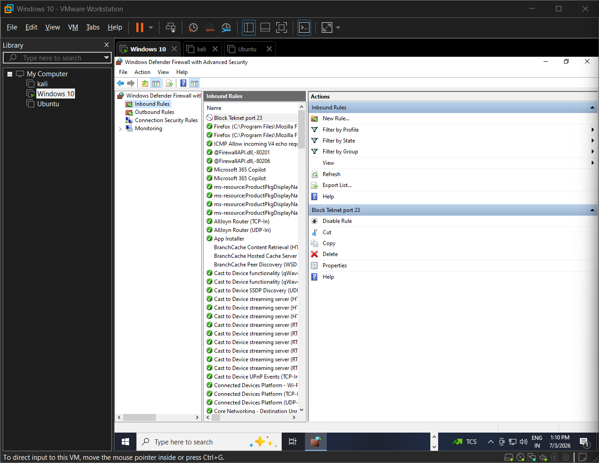

---

## Step 4 – Configure General Properties

Configured:

- Rule Description
- Enabled = Yes
- Action = Block the connection

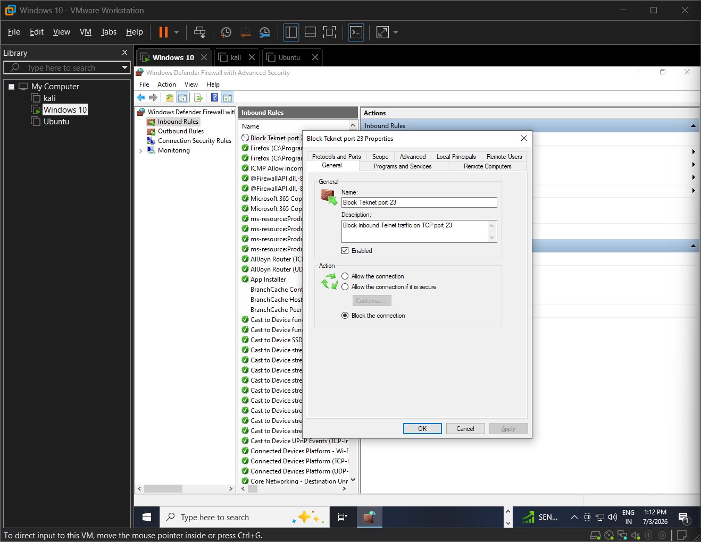

---

## Step 5 – Configure Protocol and Port

Configured:

- Protocol = TCP
- Local Port = 23

Only Telnet traffic is blocked.

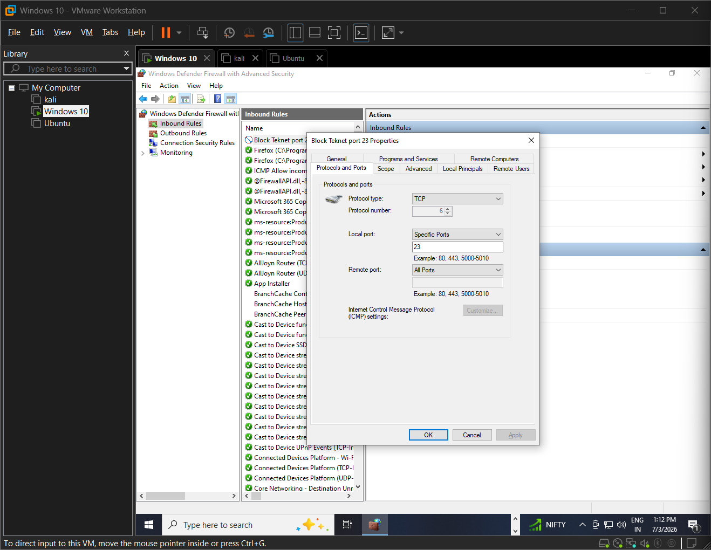

---

## Step 6 – Configure Advanced Settings

Applied the firewall rule to:

- Domain
- Private
- Public

Edge Traversal:

- Blocked

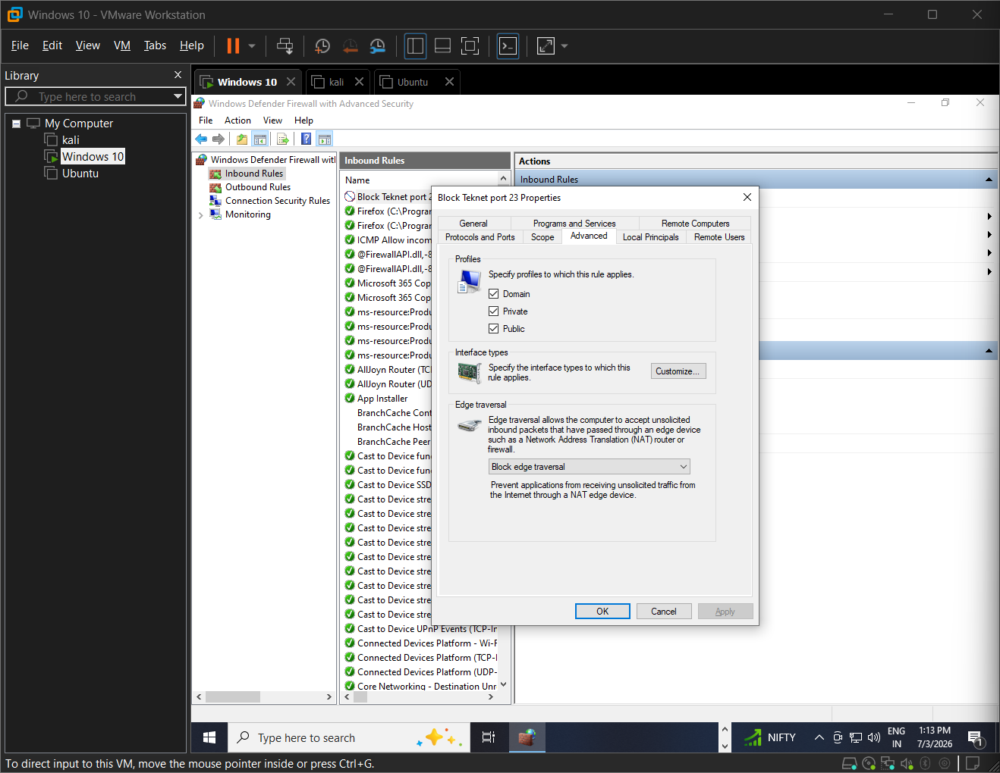

---

## Step 7 – Verify the Rule

Verified the firewall rule using Command Prompt.

```powershell
netsh advfirewall firewall show rule name="Block Telnet port 23"
```

Verified:

- Enabled = Yes
- Direction = Inbound
- Protocol = TCP
- Local Port = 23
- Action = Block

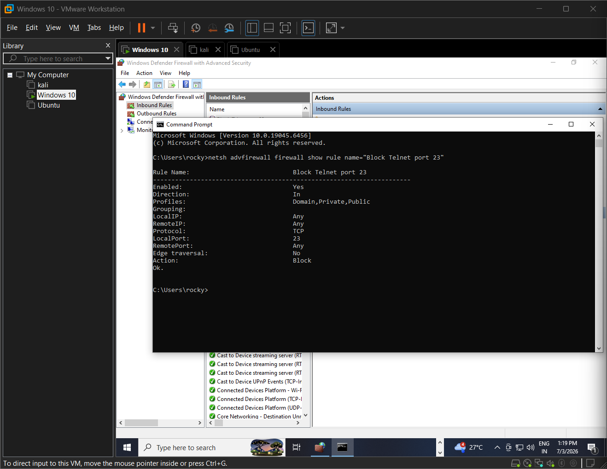

---

## Step 8 – Remove the Rule

Removed the firewall rule after testing.

```powershell
netsh advfirewall firewall delete rule name="Block Telnet port 23"

netsh advfirewall firewall show rule name="Block Telnet port 23"
```

Output:

```
No rules match the specified criteria.
```

This confirmed that the original firewall configuration was restored.

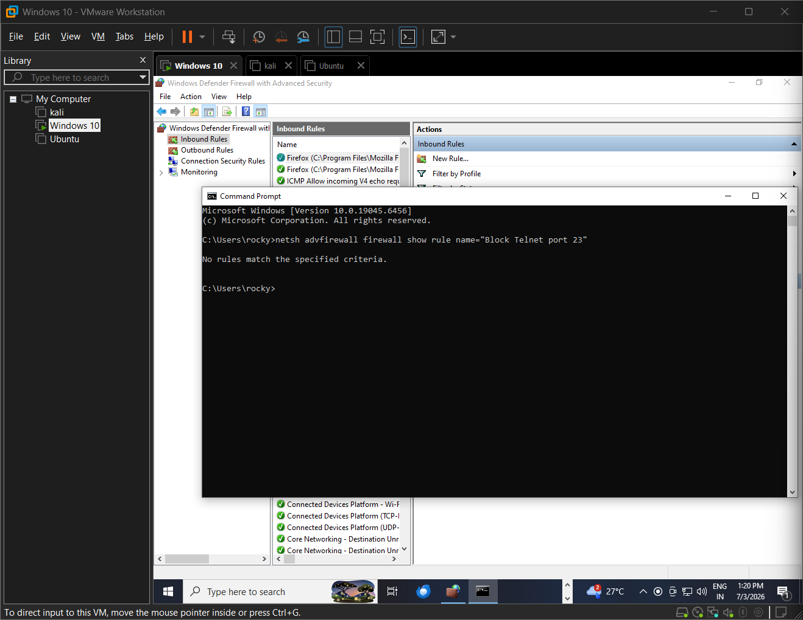

---

# 🐧 Part 2 – Ubuntu UFW

## Step 1 – Check UFW Status

Verified the firewall status.

```bash
sudo ufw status verbose
```

Checked installation.

```bash
sudo apt install ufw -y
```

Result:

- UFW Installed
- Status: Inactive

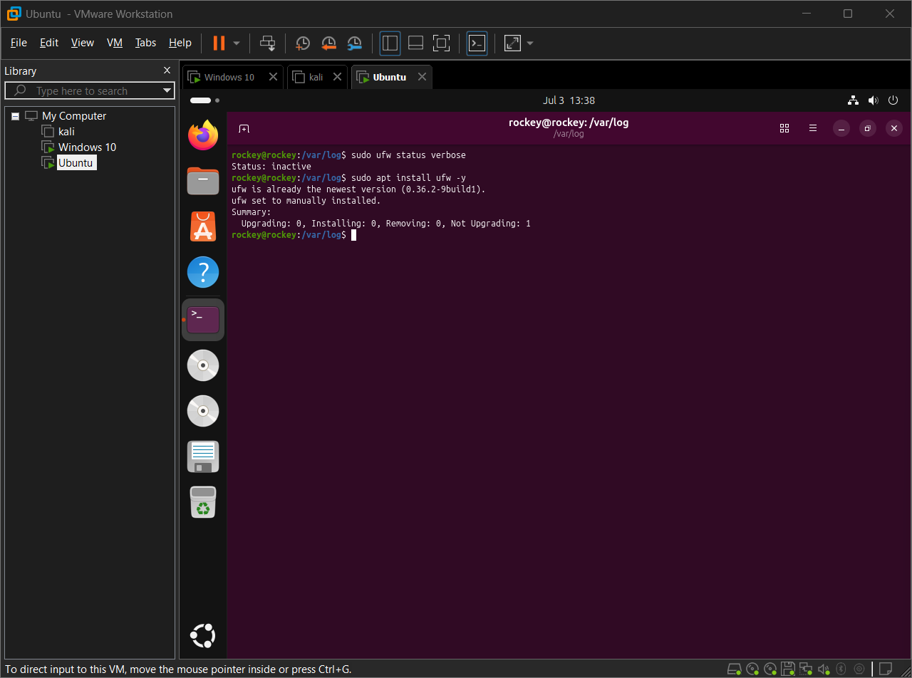

---

## Step 2 – Allow SSH and Enable UFW

Allowed SSH before enabling the firewall.

```bash
sudo ufw allow 22/tcp
```

Enabled UFW.

```bash
sudo ufw enable
```

Verified.

```bash
sudo ufw status verbose
```

Observed:

- Status: Active
- Incoming Policy = Deny
- Outgoing Policy = Allow

SSH allowed.

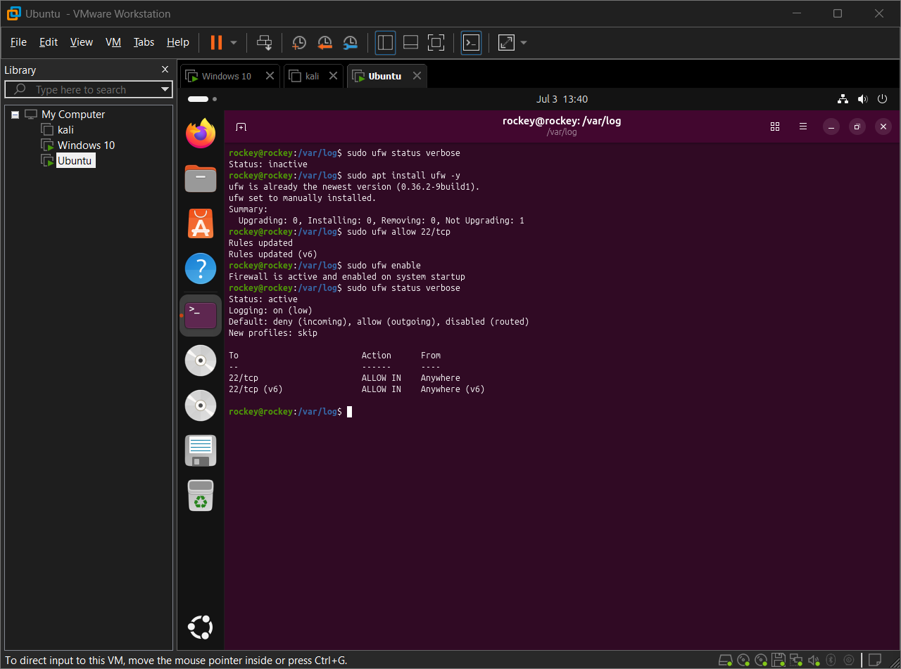

---

## Step 3 – Block Telnet

Blocked TCP Port 23.

```bash
sudo ufw deny 23/tcp
```

Verified.

```bash
sudo ufw status numbered
```

Result:

- SSH Allowed
- Telnet Blocked

Both IPv4 and IPv6 rules were created.

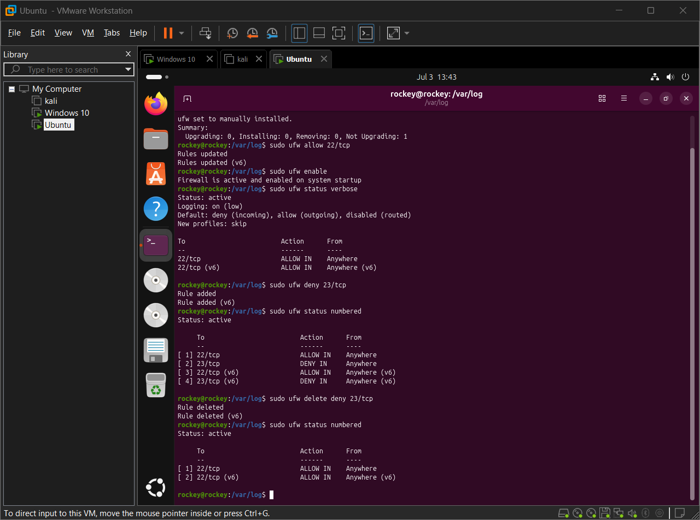

---

## Step 4 – Remove the Rule

Deleted the Telnet rule.

```bash
sudo ufw delete deny 23/tcp
```

Verified.

```bash
sudo ufw status numbered
```

Only SSH rules remained.

Firewall restored.

---

# 💻 Commands Used

## Windows

```powershell
netsh advfirewall firewall show rule name="Block Telnet port 23"

netsh advfirewall firewall delete rule name="Block Telnet port 23"
```

## Linux

```bash
sudo ufw status verbose

sudo apt install ufw -y

sudo ufw allow 22/tcp

sudo ufw enable

sudo ufw deny 23/tcp

sudo ufw status numbered

sudo ufw delete deny 23/tcp
```

---

# 🛠 Skills Demonstrated

- Windows Defender Firewall Administration
- Linux UFW Administration
- Host-Based Firewall Configuration
- TCP/IP Port Management
- Network Traffic Filtering
- Firewall Rule Creation
- Firewall Rule Verification
- Windows Command Line (`netsh`)
- Linux Command Line (`ufw`)
- Security Hardening
- VMware Virtualization

---

# 📋 Summary

Both Windows Defender Firewall and UFW are **stateful host-based firewalls** that inspect network traffic and apply predefined rules.

During this project:

- Reviewed existing firewall rules.
- Blocked TCP Port 23 (Telnet).
- Allowed TCP Port 22 (SSH).
- Verified firewall configuration.
- Removed temporary rules.
- Restored the systems to their original configuration.

---

# ✅ Outcome

Successfully configured, verified, tested, and removed firewall rules on both Windows and Linux.

This project provided practical experience with:

- Firewall Administration
- Network Security
- Port Filtering
- Rule Verification
- System Hardening
- Cross-Platform Firewall Management

---

# 🎓 Interview Questions

## 1. What is a firewall?

A firewall is a security system that monitors and filters incoming and outgoing network traffic based on predefined security rules.

---

## 2. Difference between Stateful and Stateless Firewall?

A stateful firewall tracks active network connections and automatically permits return traffic.

A stateless firewall evaluates every packet independently without remembering previous packets.

---

## 3. What are Inbound and Outbound Rules?

**Inbound Rules** control incoming traffic entering a system.

**Outbound Rules** control outgoing traffic leaving a system.

---

## 4. How does UFW simplify firewall management?

UFW provides an easy command-line interface for managing Linux firewall rules without manually configuring iptables or nftables.

---

## 5. Why block Port 23 (Telnet)?

Telnet sends usernames and passwords in plaintext.

SSH (Port 22) provides encrypted communication and is the secure replacement.

---

## 6. What are common firewall mistakes?

- Allowing unnecessary ports
- Forgetting management ports
- Leaving temporary rules enabled
- Poor documentation
- Not monitoring firewall logs

---

## 7. How does a firewall improve security?

A firewall:

- Blocks unauthorized access
- Reduces attack surface
- Filters malicious traffic
- Protects network services
- Logs security events

---

## 8. What is NAT?

Network Address Translation (NAT) translates private IP addresses into public IP addresses, allowing multiple internal devices to share a public IP while hiding internal network details.

---

# 📚 Key Concepts

- Windows Defender Firewall
- Linux UFW
- Host-Based Firewall
- Network Security
- TCP/IP
- Ports
- Inbound Rules
- Outbound Rules
- Stateful Firewall
- NAT
- Security Hardening
- VMware

---

# 📖 References

- Microsoft Learn – Windows Defender Firewall Documentation
- Ubuntu Documentation – UFW (Uncomplicated Firewall)

---

# 🏁 Conclusion

This project demonstrated practical firewall administration on both Windows and Linux by configuring, verifying, testing, and removing firewall rules. Blocking Telnet (TCP Port 23) and allowing SSH (TCP Port 22) illustrated how host-based firewalls reduce the attack surface while permitting legitimate services. Completing the task on both operating systems strengthened my understanding of firewall management, network traffic filtering, and cross-platform security administration.
